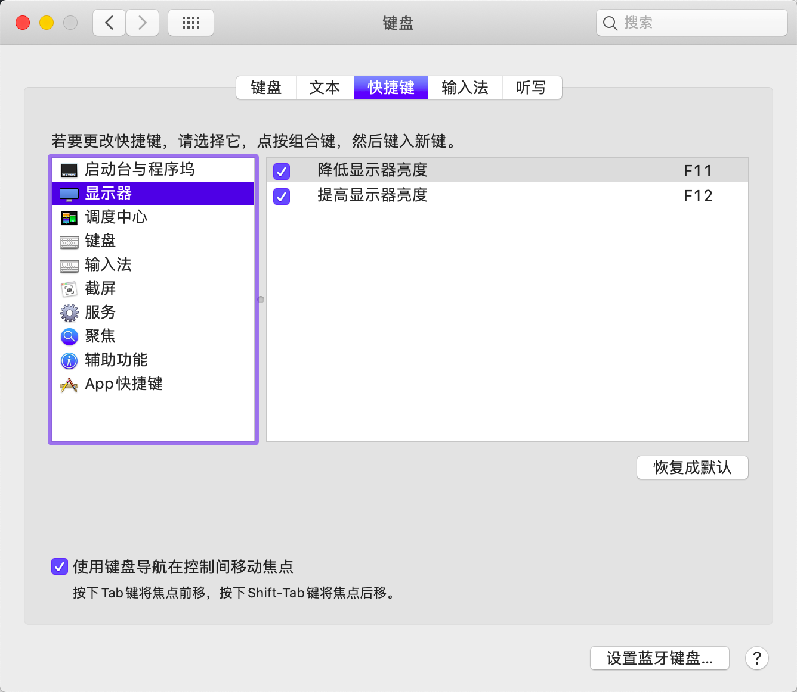

# Lenovo ideapad 700s 14ISK 黑苹果安装配置

*支持10.14、10.15*

## 电脑信息（鲁大师输出）
#### 电脑概览    
电脑型号    联想 Lenovo ideapad 700S-14ISK 笔记本电脑  (扫描时间：2020年07月09日)
操作系统    Windows 10 64位 ( DirectX 12 )
    
处理器    英特尔 Core m3-6Y30 @ 0.90GHz 双核
主板    联想 ideapad 7 ( 6th Generation Intel Processor Family I/O - 9D46 笔记本芯片组 )
内存    4 GB ( 三星 LPDDR3 1600MHz )
主硬盘    建兴 IT L8T-256L9G ( 256 GB / 固态硬盘 )
显卡    英特尔 HD Graphics 515 ( 128 MB / 联想 )
显示器    大宇 DWE0019 19W monitor ( 19 英寸  )
声卡    瑞昱  @ 英特尔 High Definition Audio 控制器
网卡    英特尔 Dual Band Wireless-AC 3165
#### 处理器信息
处理器    英特尔 Core m3-6Y30 @ 0.90GHz 双核
速度    1.51 GHz (100 MHz x 15.0)
处理器数量    核心数: 2 / 线程数: 4
核心代号    Skylake
生产工艺    14 纳米
插槽/插座    U3E1
一级数据缓存    2 x 32 KB, 8-Way, 64 byte lines
一级代码缓存    2 x 32 KB, 8-Way, 64 byte lines
二级缓存    2 x 256 KB, 4-Way, 64 byte lines
三级缓存    4 MB, 16-Way, 64 byte lines
特征    MMX, SSE, SSE2, SSE3, SSSE3, SSE4.1, SSE4.2, HTT, EM64T, EIST, Turbo Boost
#### 主板信息    
主板型号    联想 ideapad 7
芯片组    6th Generation Intel Processor Family I/O - 9D46 笔记本芯片组
BIOS版本    E3CN25WW(V2.03)  /  BIOS程序发布日期: 02/24/2016
#### 内存信息
ChannelA-DIMM0    三星 LPDDR3 1600MHz 2GB
序列号    85000000
当前频率    1600MHz
ChannelB-DIMM0    三星 LPDDR3 1600MHz 2GB
序列号    85000000
当前频率    1600MHz
#### 硬盘信息
产品    建兴  IT L8T-256L9G (固态硬盘)
容量    256 GB
形状特征    2280
硬盘已使用    共 5410 次，累计 454 小时
固件    H886201
接口    SATA III
数据传输率    600.00 MB/秒
特征    S.M.A.R.T,  48-bit LBA,  NCQ
闪存类型    MLC NAND
顺序读取速率    520 MB/秒
顺序写入速率    440 MB/秒
4K随机读取    85 KIOPS
4K随机写入    75 KIOPS
外形尺寸    22.00 x 80.00 x 3.65 毫米
#### 显卡信息
主显卡    英特尔 HD Graphics 515
显存    128 MB
制造商    联想
驱动版本    21.20.16.4627
驱动日期    20170309
#### 显示器信息
产品    友达 AUO1D3D
厂商    友达
固件程序日期    2015 年 (非显示器制造日期)
屏幕尺寸    14 英寸 (31 厘米 x 17 厘米)
显示比例    宽屏 16 : 9
分辨率    1920 x 1080 (缩放比例:125%) 32 位真彩色
最大分辨率    1920 x 1080
#### 其他硬件
- 无线网卡    英特尔 Dual Band Wireless-AC 3165
- 声卡    瑞昱  @ 英特尔 High Definition Audio 控制器
- 键盘    PS/2 标准键盘
- 键盘    HID 标准键盘
- 键盘    HID 标准键盘
- 鼠标    联想 指点杆
- 鼠标    HID-compliant 鼠标
- 摄像头    联想 EasyCamera

## 使用教程
1. 安装系统的时候请使用config_OSInstall.plist
    - 可以修改文件名到config.plist
    - 也可以在CLOVER界面上选择

2. 系统镜像我当时用的是思羽布丁的[【Len's DMG】macOS Mojave 10.14.6 18G84 With Clover 5027 and OC 双引导](https://www.mfpud.com/topics/180/)

3. 安装细节
    - 请参考[国光](https://www.sqlsec.com/2018/08/clover.html)
    - 若在安装过程中提示 **"安装 macOS xxx"应用程序副本已损坏，不能用来安装macOS**，则需要修改时间，请参考[CSDN](https://blog.csdn.net/qq_41855420/article/details/102762647)
    
4. 驱动加载（安装成功后）
    - CLOVER：复制本工程CLOVER/kext/Others下面的所有kext到自己的启动盘里面
    - /Library/Extensions ：复制LE文件夹下面的kext到/Library/Entensions 下面，终端里面执行 `sudo kextcache -i` 来重建缓存
    
5. 更换启动文件
    接下来更换为原来的config.plist启动，此时显卡，声卡，网卡，蓝牙应该已经驱动成功，内存信息正常，睡眠没问题，变频没问题，电池电量更新没问题，可以在系统设置里面调节亮度🔆

6. 开启hidpi：参照[xzhih/one-key-hidpi](https://github.com/xzhih/one-key-hidpi)

7. 键盘屏幕亮度调节
    - 用系统中的快捷键映射的方法来处理键盘亮度调节：系统偏好设置 --> 键盘 --> 快捷键 --> 显示器
    

8. 网卡驱动
    - 方法一：修改itlwm里面的plist，把自己的wifi写进去实现联网
    - 方法二：使用[客户端](https://github.com/OpenIntelWireless/HeliPort)，需要自己编译。也可使用大神编译的[HeliPort](./HeliPort.app)

9. 可以升级10.15

## 注意事项
1. 此电脑不需要打USBInjectAll.kext补丁，打此补丁会睡眠秒醒
